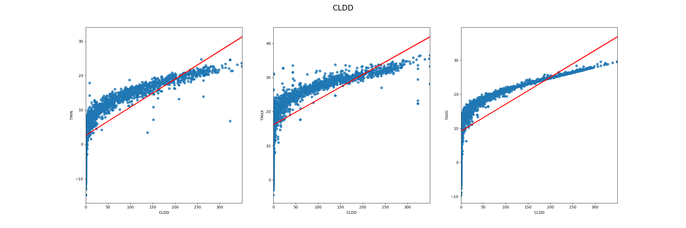
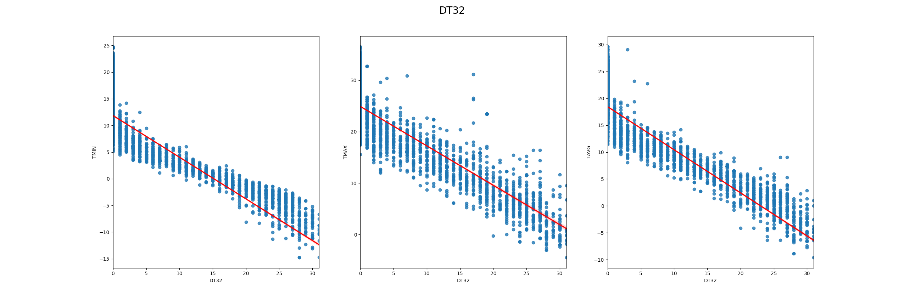
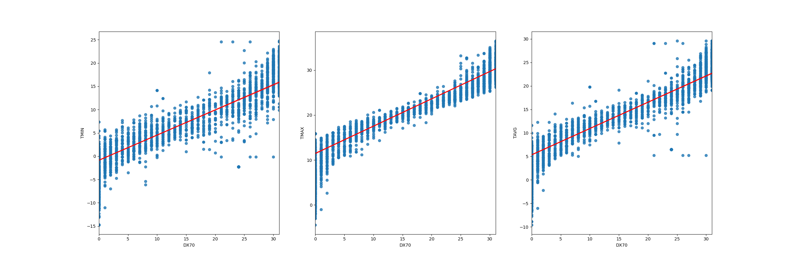
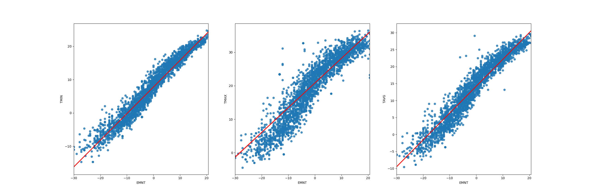
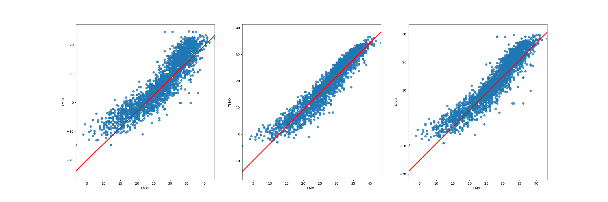
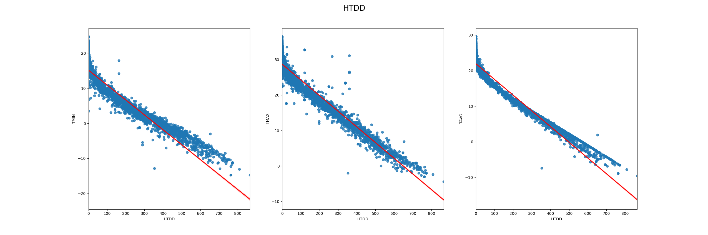

## Chủ đề
Xây dựng mô hình dự đoán nhiệt độ dựa theo bộ dữ liệu theo tháng của trạm USC. 

## Biểu đồ
Biểu đồ thể hiện mối quan hệ tuyến tính giữa các thuộc tính với nhiệt độ.







## Thuật toán
Sử dụng hồi quy tuyến tính để dự đoán nhiệt độ.

## Kết quả
```python
## TRAIN SET
[=] TMIN: [*] MSE error: 0.6780580866958524
[=] TMAX: [*] MSE error: 0.955749488446695
[=] TAVG: [*] MSE error: 0.23724220251560518

## TEST SET
[=] TMIN: [*] MSE error: 1.0315703635227735
[=] TMAX: [*] MSE error: 1.44284969016253
[=] TAVG: [*] MSE error: 0.48001949615866096
```