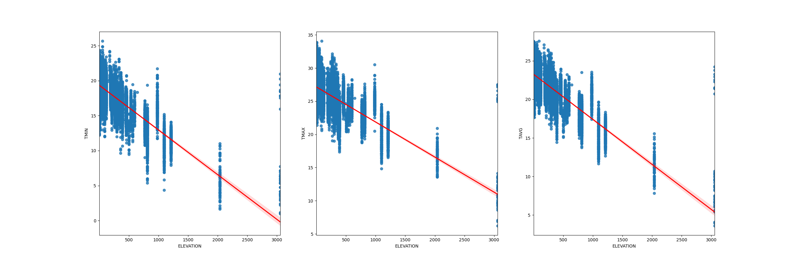

## Chủ đề
Xây dựng mô hình dự đoán nhiệt độ dựa theo bộ dữ liệu theo tháng của trạm USC. 

## Biểu đồ
[Correlation Score](correlation.csv)  
Lấy ngưỡng là 0.7 ta được các biểu đồ sau.  
Biểu đồ thể hiện mối quan hệ tuyến tính giữa các thuộc tính với nhiệt độ.




## Thuật toán
Sử dụng hồi quy tuyến tính để dự đoán nhiệt độ.

## Kết quả
```python
## TRAIN SET
[=] TMIN:
	[*] MAE error: 0.47247438497885114
	[*] RMSE error: 0.6254488696926046
[=] TMAX:
	[*] MAE error: 0.476735816779323
	[*] RMSE error: 0.6245444434938698
[=] TAVG:
	[*] MAE error: 0.11786874192741226
	[*] RMSE error: 0.19879482659122233

## TEST SET
[=] TMIN:
	[*] MAE error: 0.49953092669201815
	[*] RMSE error: 0.650159355646133
[=] TMAX:
	[*] MAE error: 0.48573974855244995
	[*] RMSE error: 0.6165218927429887
[=] TAVG:
	[*] MAE error: 0.13005632219437713
	[*] RMSE error: 0.20206556256600883
```