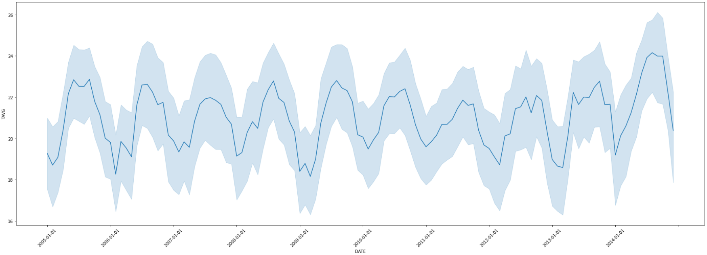
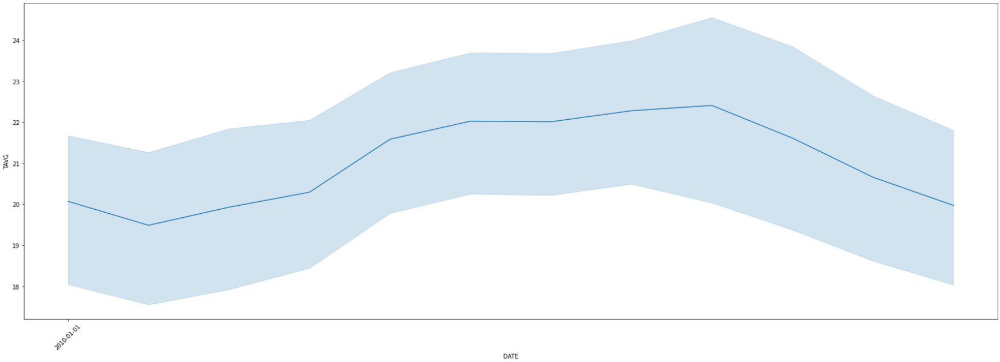

## Chủ đề
Mô tả dữ liệu về TAVG (nhiệt độ trung bình) trong vòng 10 năm từ 2010 đến 2020 của các trạm USC.

### Biểu đồ

**Biểu đồ 1:** - Nhiệt độ trung bình từ năm 2005-2014.

**Biểu đồ 2:** - Nhiệt độ trung bình trong năm 2010.

### Mô tả
Sau khi đọc qua dữ liệu và xử lí lại các dữ liệu bị thiếu, ta có được biểu đồ về nhiệt độ trung bình như trên

Với bộ dữ liệu từ 2005-2014, ta có các dữ liệu sau:
- Nhiệt độ trung bình cao nhất là 27.460000
- Nhiệt độ trung bình thấp nhất là 11.300000
- Mean là 20.984022
- Độ lệch chuẩn là 3.577484

Nhiệt độ trung bình cao nhất cũng như nhiệt độ trung bình thấp nhất chênh lệch không đáng kể trong các năm (2005-2014).

Dựa vào đồ thị có thể thấy rằng nhiệt độ có chu kì rõ ràng hàng năm tại trạm USC. Khi nhìn rõ hơn vào biểu đồ 2 thì có thể thấy rằng trong năm thì nhiệt độ tăng dần từ tháng 1 đến khoảng tháng 7 và bắt đầu giảm dần từ tháng 7 đến tháng 12 và cứ thế lặp lại trong các năm tiếp theo.

